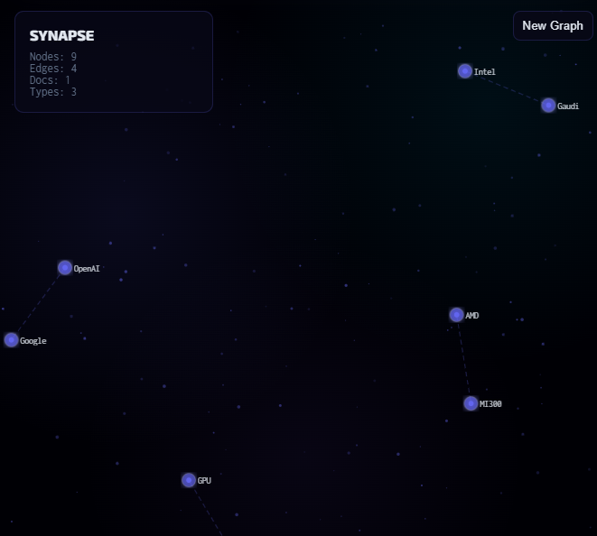

<div align="center">

# 🧬 SYNAPSE GraphRAG

### A Cosmic Knowledge Intelligence Engine — Upload Documents, Build a Living Graph, Ask Smarter Questions

[](https://www.python.org/)
[](https://fastapi.tiangolo.com/)
[](https://react.dev/)
[](https://d3js.org/)
[](https://groq.com/)
[](LICENSE)

<br/>

> **SYNAPSE** is a full-stack GraphRAG application that turns multiple documents into a connected knowledge graph, then answers questions by combining **vector retrieval + graph traversal**. Instead of plain chunk similarity, it highlights relationships across entities, concepts, and evidence paths.

</div>

---

## 📋 Table of Contents

- [Overview](#-overview)
- [Application Preview](#-application-preview)
- [Features](#-features)
- [Architecture](#-architecture)
- [Tech Stack](#-tech-stack)
- [Project Structure](#-project-structure)
- [Installation](#-installation)
- [Usage](#-usage)
- [API Reference](#-api-reference)
- [Configuration](#-configuration)
- [Deployment](#-deployment)

---

## 🧠 Overview

SYNAPSE helps you reason across documents, not just search inside them.

It:
- extracts named entities and concepts from uploaded PDFs/TXT files
- builds a graph with relationship edges and connection weights
- creates embeddings for retrieval context
- answers with graph-aware synthesis powered by Groq
- lights up activated nodes for visual explanation

---

## 🖼️ Application Preview

<div align="center">

### Main Graph Universe


</div>

---

## ✨ Features

| Feature | Description |
|---|---|
| 🌌 **Cosmic Graph UI** | D3-driven interactive graph with glowing nodes, drifting particles, and animated edges |
| 🧾 **Multi-Doc Upload** | Upload up to 5 `.pdf`/`.txt` files per run |
| 🧠 **GraphRAG Retrieval** | Combines vector chunk search with graph-neighborhood traversal |
| ⚡ **Live Processing Events** | WebSocket events for upload, extraction, activation, and answer stages |
| 📌 **Node Inspector** | Click any node to inspect linked evidence and relationship context |
| 📊 **Useful Insights Panel** | Top nodes, relation counts, and practical graph signals |
| 💼 **Business Summary Button** | One-click executive summary (insights, risks, opportunities, 30/60/90 actions) |
| 🧪 **Complex Sample Dataset** | Included `complex_*.txt` docs for meaningful cross-domain demo graphs |

---

## 🏗️ Architecture

```text
Documents (.pdf/.txt)
  -> Text extraction + cleaning
  -> Entity / concept extraction (spaCy)
  -> Relationship extraction (co-occurrence + relation verb hints)
  -> Knowledge graph nodes + edges (in-memory)
  -> Embeddings + vector store (ChromaDB)
  -> Query pipeline:
       Vector retrieval + relevant-node scoring + subgraph context
  -> Groq answer synthesis
  -> Frontend activation + visualization
```

---

## 🛠️ Tech Stack

| Layer | Technology |
|---|---|
| Frontend | React, D3.js, Framer Motion, Axios |
| Backend | FastAPI, Uvicorn, Pydantic |
| NLP | spaCy (`en_core_web_sm`) |
| Vector Store | ChromaDB |
| LLM Provider | Groq (`llama-3.3-70b-versatile`) |
| Embeddings | Groq embeddings (`nomic-embed-text-v1.5`) |
| Parsing | PyMuPDF for PDFs |

---

## 📁 Project Structure

```text
synapse-graphrag/
├── backend/
│   ├── main.py
│   ├── document_processor.py
│   ├── entity_extractor.py
│   ├── graph_builder.py
│   ├── graph_store.py
│   ├── graph_retriever.py
│   ├── groq_service.py
│   ├── requirements.txt
│   └── .env.example
├── frontend/
│   ├── src/
│   ├── public/
│   ├── package.json
│   └── vercel.json
├── sample_docs/
│   ├── ai_trends.txt
│   ├── market_analysis.txt
│   ├── company_strategy.txt
│   └── complex_*.txt
├── docs/screenshots/
├── DECISIONS.md
├── LICENSE
├── README.md
└── render.yaml
```

---

## 🚀 Installation

### Prerequisites
- Python 3.11+
- Node.js 18+
- Groq API key

### 1) Backend
```bash
cd backend
python -m venv venv
venv\Scripts\activate
pip install -r requirements.txt
python -m spacy download en_core_web_sm
copy .env.example .env
```

Edit `backend/.env`:
```bash
GROQ_API_KEY=your_groq_api_key_here
GROQ_MODEL=llama-3.3-70b-versatile
GROQ_EMBEDDING_MODEL=nomic-embed-text-v1.5
```

Run backend:
```bash
uvicorn main:app --reload --host 0.0.0.0 --port 8000
```

### 2) Frontend
```bash
cd ../frontend
npm install
npm start
```

Frontend: `http://localhost:3000`  
Backend: `http://localhost:8000`

---

## 💻 Usage

1. Open `http://localhost:3000`
2. Upload 1-5 documents
3. Wait for graph build completion
4. Ask custom questions or click **Business Summary**
5. Click nodes to inspect linked evidence

For a richer demo, upload:
- `sample_docs/complex_board_memo_q3.txt`
- `sample_docs/complex_market_intel_2027.txt`
- `sample_docs/complex_incident_and_postmortem.txt`
- `sample_docs/complex_finance_and_hiring_plan.txt`

---

## 🔌 API Reference

| Method | Endpoint | Description |
|---|---|---|
| `GET` | `/` | Health check |
| `POST` | `/upload` | Upload docs and build graph |
| `GET` | `/graph` | Return current graph |
| `POST` | `/query` | Ask graph-aware question |
| `GET` | `/status` | Graph status and counts |
| `WS` | `/ws` | Live processing events |

---

## ⚙️ Configuration

`backend/.env`:
```bash
GROQ_API_KEY=...
GROQ_MODEL=llama-3.3-70b-versatile
GROQ_EMBEDDING_MODEL=nomic-embed-text-v1.5
```

`frontend` optional env:
```bash
REACT_APP_API_URL=http://localhost:8000
REACT_APP_WS_URL=ws://localhost:8000/ws
```

---

## 🚢 Deployment

### Render (Backend)
- Uses `render.yaml`
- Set env var: `GROQ_API_KEY`

### Vercel (Frontend)
- Deploy `frontend/`
- Set env vars:
  - `REACT_APP_API_URL=https://your-backend-url`
  - `REACT_APP_WS_URL=wss://your-backend-url/ws`

---

<div align="center">

Built with ❤️ for GraphRAG-first document intelligence.

</div>
